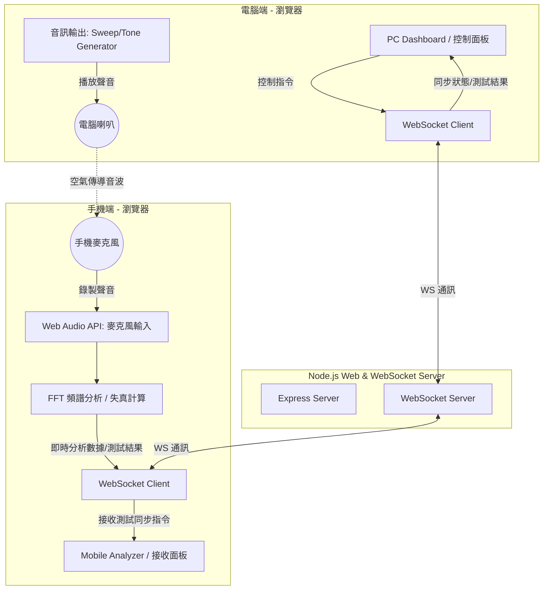

# 喇叭好壞測試器 (Speaker Quality Tester) 實作計畫

此專案旨在開發一個整合「電腦端 (PC) 控制與輸出」與「手機端 (Mobile) 接收與分析」的喇叭品質測試系統。兩端將透過 WebSocket 進行雙向即時通訊，達到同步測試與即時呈現結果的目的。

## 系統架構設計

---

## 核心功能規劃

### 1. 同步伺服器 (Server)
- **Express 伺服器**: 提供電腦端與手機端的網頁靜態檔案。
- **WebSocket 伺服器**: 
  - 協調電腦端與手機端的配對與通訊。
  - 當電腦端發送「開始測試（掃頻/單音）」指令時，廣播給手機端，令其同步啟動麥克風錄製與 FFT 分析。
- **IP 自動偵測與 QR Code**: 啟動時自動偵測本機 IP，在控制台輸出並在電腦端網頁顯示 QR Code，方便手機掃描連線。

### 2. 電腦端控制台 (PC Dashboard)
- **連線狀態**: 顯示手機端是否已連線配對。
- **音訊產生器 (Audio Generator)**:
  - **自動掃頻測試 (Sine Sweep)**: 播放 20Hz 到 20kHz 的對數掃頻，可用於繪製完整的頻率響應曲線。
  - **單音測試 (Single Tone)**: 播放特定頻率（如 1kHz），用以測試特定頻點的諧波失真 (THD)。
  - **噪聲測試 (Noise)**: 播放粉紅噪聲 (Pink Noise) 或白噪聲 (White Noise) 以進行寬頻分析。
- **資料可視化**:
  - 即時頻率響應曲線圖 (Frequency Response Curve)。
  - 即時噪聲/音量監控。
  - 測試報告展示：包含評分（Excellent / Good / Fair / Poor）、低頻截止點、高頻截止點、頻率平坦度與估算失真率。

### 3. 手機端接收器 (Mobile Analyzer)
- **環境噪聲校準 (Calibration)**: 測試前先錄製環境背景噪音，作為運算基底。
- **即時 FFT 分析 (Web Audio AnalyserNode)**:
  - 擷取麥克風音訊，利用 Web Audio API 的 `AnalyserNode` 進行即時頻譜分析。
  - 計算特定頻率的響應振幅。
  - 估算諧波失真 (THD - Total Harmonic Distortion): 當電腦播放 1kHz 單音時，分析 2kHz、3kHz 等諧波能量相對於基頻的比例。
- **同步控制邏輯**:
  - 當收到伺服器轉發的 `start-sweep` 指令時，手機端開始同步錄製對應時間段的頻譜振幅，並在測試完成後將響應曲線數據包裝發送給 PC。
- **簡易 UI**: 顯示目前接收分貝 (dB)、目前分析頻點與連線狀態，提供簡潔美觀的指引畫面。

---

## 使用者審查項目 (User Review Required)

> [!IMPORTANT]
> **1. 雙端瀏覽器安全性限制 (HTTPS vs HTTP)**
> 手機端要取得麥克風權限 (`getUserMedia`)，在非 `localhost` 的連線下通常**必須使用 HTTPS**。
> - **解決方案**: 
>   1. 我們將在伺服器端整合自動生成自我簽署憑證 (Self-signed certificate) 以啟用 HTTPS，或者
>   2. 提示使用者在手機端瀏覽器（如 Chrome）中設定 `unsafely-treat-insecure-origin-as-secure` 允許該特定 IP 的 HTTP 麥克風權限。
>   *建議採用方案 1 (提供自簽 HTTPS 選項) 或引導使用者進行設定，以獲得最佳體驗。*
>
> **2. 喇叭與麥克風硬體校準限制**
> 手機麥克風本身的頻率響應並非完全平坦（通常在低頻與高頻會有衰減）。
> - 本系統測得的「喇叭好壞」實際上是「電腦喇叭播放 + 空間傳播 + 手機麥克風接收」的綜合響應。
> - 我們將加入「相對評估法」（如與基準曲線對比，或著重於諧波失真與頻譜平滑度），並在 UI 上做適當說明。

---

## 開發規劃與時程 (Proposed Changes)

我們將採用單一 Node.js 專案架構，目錄規劃如下：

### [Node.js & Vanilla Web Application]

#### [NEW] [package.json](file:///C:/Users/10110012/Documents/antigravity/splendid-turing/package.json)
設定專案依賴（`express`, `ws`, `qrcode` 等）。

#### [NEW] [server.js](file:///C:/Users/10110012/Documents/antigravity/splendid-turing/server.js)
實作 Express 靜態檔案伺服、自動 IP 偵測與 WebSocket 伺服器。

#### [NEW] [public/index.html](file:///C:/Users/10110012/Documents/antigravity/splendid-turing/public/index.html)
主入口網頁，根據 URL 參數（如 `?role=pc` 或 `?role=mobile`）分流載入 PC 控制台或手機接收端。

#### [NEW] [public/css/style.css](file:///C:/Users/10110012/Documents/antigravity/splendid-turing/public/css/style.css)
採用現代暗色系、微漸層與毛玻璃玻璃擬物化 (Glassmorphism) 設計的 Premium UI 樣式表。

#### [NEW] [public/js/pc.js](file:///C:/Users/10110012/Documents/antigravity/splendid-turing/public/js/pc.js)
PC 控制端邏輯：發送測試指令、利用 Web Audio 產生測試音訊、使用 Chart.js 或 Canvas 繪製即時頻譜與測試報告。

#### [NEW] [public/js/mobile.js](file:///C:/Users/10110012/Documents/antigravity/splendid-turing/public/js/mobile.js)
手機接收端邏輯：調用麥克風、即時 FFT 運算、音量監控、諧波失真估算、同步資料回傳。

#### [NEW] [public/js/shared-ws.js](file:///C:/Users/10110012/Documents/antigravity/splendid-turing/public/js/shared-ws.js)
共用的 WebSocket 連線與訊息封裝邏輯。

---

## 驗證計畫 (Verification Plan)

### 自動與手動測試
1. **啟動伺服器**: 執行 `npm start`，檢查是否正確偵測 IP 並啟動 HTTP/WebSocket 服務。
2. **PC 端連線**: 電腦打開 `http://localhost:3000/?role=pc`，確認 UI 渲染正常、顯示連線 QR Code，且能正常播放測試聲音。
3. **手機端連線**: 手機與電腦連線至同一區域網路 (Wi-Fi)，掃描 QR Code 進入網頁，點擊「啟用麥克風」並確認 WebSocket 連線成功。
4. **同步測試驗證**:
   - 點擊 PC 端的「開始掃頻測試」。
   - 確認手機端自動進入「接收分析狀態」，且隨著電腦聲音播放，手機端即時顯示分貝數。
   - 測試完成後，確認手機端成功將數據發送回伺服器，且 PC 端能即時繪製出「頻率響應曲線」與「喇叭評分報告」。
